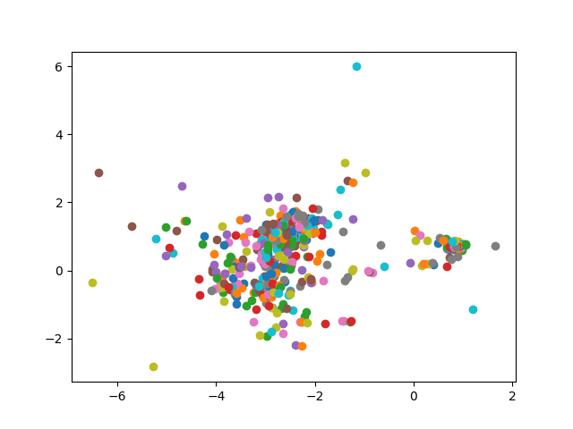

## SpringMassClustering

Damped spring mass system based clustering algorithm for weighted networks. 

### Example:



Source:
````
Colizza, V., Pastor-Satorras, R., Vespignani, A., 2007. 
Reaction-diffusion processes and metapopulation models in 
heterogeneous networks. Nature Physics 3, 276-282.
````